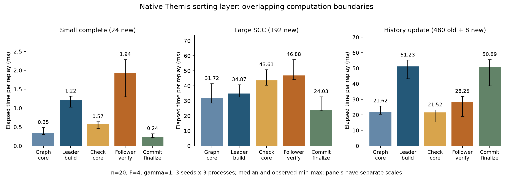
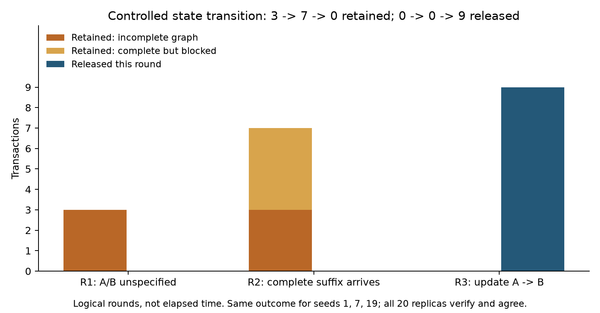

# Themis 固定工作负载微基准与状态实验

本轮只增加测试场景、状态测试和采集/分析脚本，生产协议与调度代码不变。结果属于当前仓库的 Themis 排序层，不是完整 Themis–HotStuff 性能复现。

基线提交：`e679a8976ec718cafa7b4e6ad04a08624b2e5371`。Go：`go version go1.24.5 windows/amd64`；CPU：`AMD Ryzen 7 7840HS with Radeon 780M Graphics`；OS：`Windows-11-10.0.26200-SP0`。完整工作树状态和源文件 SHA-256 在 environment.json。

固定 n=20、F=4、γ=1、512-byte payload；seeds=1/7/19；每 seed 3 个新 Go 进程，GOMAXPROCS=1，benchtime=1s。共 135 个阶段观测。合成接收顺序和真实签名证据在计时外产生；不运行 ticker，因此没有 lo_interval/lo_size 敏感性。

## 1. 计算结果

下表是各阶段 9 个观测的中位数，单位 ms/op（默认 3 进程时）。五列有包含关系，不能相加为端到端延迟，也不是互斥的堆叠分解。

| 工作负载 | GraphCore | LeaderBuildFull | CandidateCheckCore | FollowerVerifyFull | CommitFinalizeFull |
|---|---:|---:|---:|---:|---:|
| Small complete (24 new) | 0.353 | 1.216 | 0.575 | 1.936 | 0.242 |
| Large SCC (192 new) | 31.722 | 34.875 | 43.615 | 46.882 | 24.032 |
| History update (480 old + 8 new) | 21.623 | 51.229 | 21.521 | 28.247 | 50.893 |

| 工作负载 | 配对 Verify/Build 中位数 [min, max] | 新图节点/边/最大 SCC | 旧图数/旧交易 | 更新边/释放交易 |
|---|---:|---:|---:|---:|
| mechanism_small | 1.593 [0.988, 2.219] | 24/276/1 | 0/0 | 0/24 |
| mechanism_cycle | 1.365 [1.177, 1.515] | 192/18336/192 | 0/0 | 0/192 |
| mechanism_update | 0.547 [0.395, 0.657] | 8/28/1 | 4/480 | 1/488 |

ρ 在同一 seed、进程、repeat 的相同输入状态内配对。它描述当前实现验证重算与构造的量级，不能解释为 AUTIG 加速比，不能乘以 n−1 推导集群节省。大环和小图同时改变规模及结构，不能用二者差值单独归因于 SCC。

所有耗时 min/max、累计分配 B/op、allocs/op 在 mechanism-summary.json；各 seed 的进程间统计在 summary.json；原始记录在 measurements.csv。B/op 是每次调用的累计分配，不是保留状态大小或峰值内存。阶段顺序固定，未做顺序平衡；本机后台活动、GC、缓存和频率变化均可能影响结果。三种 seed 改变交易 ID/排序细节，保持图规模一致，不代表三种独立网络负载。

## 2. 独立预期与状态结果

采用 2022 修订版，结合作者后续正文的单方出现计票定义。此配置采用 16 份证据，solid 门槛 12，建边门槛 5。期望图写在状态测试中；权重通过独立列表扫描计算，SCC 通过独立可达性计算，不调用生产构图或排序函数生成期望答案。

| 场景/轮次 | 新节点/边/最大 SCC | 新增旧图边 | 本轮释放 | 轮后保留 | 其中完整但被阻塞 |
|---|---:|---|---:|---:|---:|
| unanimous R1 | 3/3/1 | 无 | 3 | 0 | 0 |
| complete_cycle R1 | 3/3/3 | 无 | 3 | 0 | 0 |
| deferred R1 | 3/2/1 | 无 | 0 | 3 | 0 |
| deferred R2 | 4/6/1 | 无 | 0 | 7 | 4 |
| deferred R3 | 2/1/1 | 1:A>B | 9 | 0 | 0 |

一致接收 ABC 产生全序并释放 3 笔。环样本的 16 份报告为 ABC×6、BCA×5、CAB×5；票数 AB:BA=11:5、BC:CB=11:5、CA:AC=10:6，形成完整三节点环，仍释放全部交易。测试允许合法 Hamiltonian 路径的旋转，同时要求各副本最终顺序一致。

阻塞轮报告为 ABZ×4、BAZ×4、Z×4、空×4。A/B 各出现 8 次，Z 出现 12 次；AB/BA 各 4 票，均不达 5；AZ/ZA=8:4，BZ/ZB=8:4。因此两条 shaded→solid 边保留，A/B 关系未定。R2 的 4 笔完整后续交易也须等待。R3 只追加各副本未收到的旧交易和两笔新交易，保持原接收顺序，更新 AB/BA=12:4 且 A 达到 16 次出现，合法补 A→B，按 proposal 顺序释放 3+4+2=9 笔。

15 条状态记录（3 seeds × 5 轮）均通过；每轮 20 个逻辑副本分别执行真实验证和提交并比较协议状态。它是 20 个内存服务对象，不是 20 个独立网络节点。使用固定发送者 0..15；未测试首到报告选择、恶意节点、网络或完整共识。

## 3. 可以与不可以支持的结论

可以作为 AUTIG 论文中的 Themis 机制补充：本实现的候选验证仍执行图重算；完整 SCC 本身不意味着 deferred；未指定关系能导致后续完整 proposal 等待，后续证据可以解除等待。状态实验说明机制的存在，不说明这种情况在单区或跨区中的发生频率，也不测等待的毫秒数。

本次不修复或优化生产路径中的邻接表扫描、图比较、历史扫描或克隆成本。CPU profiles 仅辅助辨识本实现热点，不能把自主实现成本都归为论文算法固有缺陷。不能据此推导 TPS、公平性概率、恶意节点性能或端到端延迟。

已有 150 ms 单区/跨区数据原样保留。因为本次不修改生产行为，这组补充实验本身不要求重跑它们；但旧数据的代码版本、运行有效性、输入饱和度和指标边界仍须单独审核。新状态测试不能追认其他旧版本的正确性，也不能把 150 ms 宣称为 Themis 官方参数或最佳性能。

## 4. 复现与证据

复现命令及计时边界见 [THEMIS_MECHANISM.md](../../THEMIS_MECHANISM.md)。environment.json 保存微基准命令、源码哈希、系统信息；mechanism-environment.json 保存状态/profile 命令及原始产物哈希；state-rows.json 保存逐副本实际列表、Update、完整接收历史和每轮摘要。CPU profile 单独采集，未混入计时。

论文依据：[2022 修订版](https://eprint.iacr.org/archive/2021/1465/1669765544.pdf)，§IV / 图1–3；[作者博士论文](https://mahimnakelkar.github.io/dissertation.pdf)，第6章、印刷页138 的 Weight 定义。此前逐项核验见 benchmark/review-20260913-independent/REVIEW.md。
