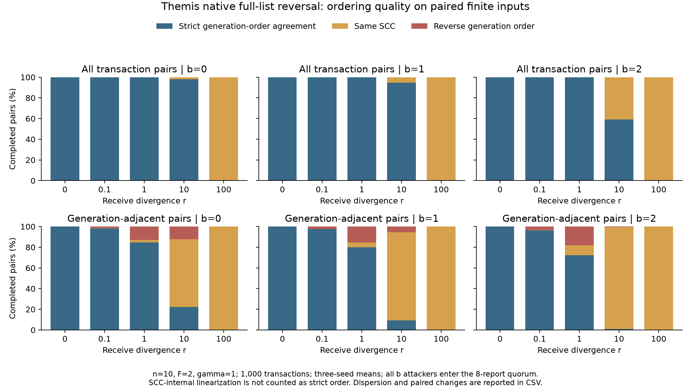

# Themis 原生反转攻击：固定输入回放结果

本轮新增代码只有 `pkg/ofo/ordering_replay_test.go`。不改生产算法、攻击分支、lo_size/lo_interval 或 AUTIG；没有新增运行器、辅助函数、工具类或生产抽象。统计和绘图使用一次性命令，产物保存在本目录。

## 执行与边界

- 固定 n=10、F=2、γ=1，1000笔，r=0/0.1/1/10/100，seed=1/7/19，b=0/1/2，共45组；专项 Go 测试通过，约427.939秒。未运行额外的全仓库检查或参数扫描。
- 直接读取 AUTIG 原有15个 b=0 输入JSON，各b复用相同轨迹和交易ID。原始输入SHA-256、采用的报告、最终顺序和SCC批次编号均在 measurements.jsonl。
- 两仓库哈希编码不同。仅在测试中将16字节原始内容编码为 length(16)||content，共24字节，使Themis原生接收检查得到与AUTIG相同的交易ID。首次运行在身份核对处停止，未产生实验结果；修正后完整重跑，未混合失败记录。
- 10个逻辑副本通过原生接收和签名函数产生完整列表。固定采用节点2..9，使末尾b个恶意节点全部进入八份证据。leader构建，另一副本原生验证，两者原生提交并比较最终顺序。并非10个网络节点或完整共识实验。
- Themis每份新列表含1000笔，原生攻击反转整份列表；AUTIG原实验反转每个200笔的新LO块，且采用旋转发送者集合。因此两者攻击内容和选证路径不同，不能由这些结果直接宣称谁抗同一攻击更强。
- 全部输入预先可用，Themis每组只有一个1000节点、499500条边的完整proposal，所有交易均solid。没有人为截断，没有周期上报；45组全部完成，deferred均为0。本组不测试在线等待或跨proposal释放。

## 独立公平性检查

Themis使用2022修订版 Definition III.1 的 γn=10 个原始接收者门槛，而不是AUTIG的8个诚实接收者门槛。达到门槛的交易对须处于同一或更早SCC批次；缺失前驱或逆批次计违反。SCC只用于描述原生输出粒度，不作为接收顺序真值。对每个非单点SCC的实际输出环（含首尾闭合），另从原始诚实接收顺序检查每条链接至少有 n(1−γ)+1=1 个诚实支持者，并检查最终输出每对相邻交易的同一支持门槛。

45组中公平性违反、循环依据违反、相邻顺序保证违反均为0；全部已触发约束均被检查。它是这些输入上的经验结果，不是全执行正确性证明。不同b使用相同原始接收数据，Themis的10节点触发集合不变；这与AUTIG按诚实子集计算的覆盖率不同。

| r | 公平性约束覆盖率（三种子均值） |
|---|---:|
| 0 | 100.0000% |
| 0.1 | 99.9544% |
| 1 | 99.5443% |
| 10 | 95.5101% |
| 100 | 61.0609% |

## 排序质量

以下严格/同SCC/反向均以原始生成顺序为参考；同SCC不因为Hamiltonian线性输出而计作严格关系。反向生成顺序不自动等于公平性违反。百分比是三个种子的均值；完整标准差、有效种子数见 summary.csv。交易对共享交易，不能当成独立重复实验。

| r | b | 严格 % | 同SCC % | 反向 % | 最大SCC均值 |
|---|---:|---:|---:|---:|---:|
| 0 | 0 | 100.0000 | 0.0000 | 0.0000 | 1.0 |
| 0 | 1 | 100.0000 | 0.0000 | 0.0000 | 1.0 |
| 0 | 2 | 100.0000 | 0.0000 | 0.0000 | 1.0 |
| 0.1 | 0 | 99.9964 | 0.0004 | 0.0032 | 2.3 |
| 0.1 | 1 | 99.9948 | 0.0002 | 0.0050 | 1.7 |
| 0.1 | 2 | 99.9919 | 0.0010 | 0.0071 | 3.0 |
| 1 | 0 | 99.9594 | 0.0087 | 0.0318 | 4.3 |
| 1 | 1 | 99.9359 | 0.0221 | 0.0420 | 6.0 |
| 1 | 2 | 99.8938 | 0.0521 | 0.0541 | 8.3 |
| 10 | 0 | 98.1945 | 1.7300 | 0.0755 | 56.0 |
| 10 | 1 | 94.7542 | 5.2073 | 0.0385 | 120.7 |
| 10 | 2 | 59.0693 | 40.9257 | 0.0050 | 527.0 |
| 100 | 0 | 0.1328 | 99.8667 | 0.0005 | 999.3 |
| 100 | 1 | 0.0665 | 99.9333 | 0.0001 | 999.7 |
| 100 | 2 | 0.1311 | 99.8667 | 0.0022 | 999.3 |

全部交易对每组499500对。另导出生成位置 d=1、d≤5、d≤10 的重叠范围，分母分别999、4985、9945；这些不是最终输出邻接。

| r | b | 生成相邻对严格 % | 同SCC % | 反向 % |
|---|---:|---:|---:|---:|
| 0 | 0 | 100.0000 | 0.0000 | 0.0000 |
| 0 | 1 | 100.0000 | 0.0000 | 0.0000 |
| 0 | 2 | 100.0000 | 0.0000 | 0.0000 |
| 0.1 | 0 | 98.2983 | 0.1335 | 1.5682 |
| 0.1 | 1 | 97.5309 | 0.0667 | 2.4024 |
| 0.1 | 2 | 96.2629 | 0.3337 | 3.4034 |
| 1 | 0 | 84.7181 | 2.3357 | 12.9463 |
| 1 | 1 | 79.8465 | 4.9049 | 15.2486 |
| 1 | 2 | 72.2723 | 9.4428 | 18.2850 |
| 10 | 0 | 22.1555 | 65.5656 | 12.2789 |
| 10 | 1 | 9.3093 | 85.2519 | 5.4388 |
| 10 | 2 | 1.0010 | 98.4318 | 0.5672 |
| 100 | 0 | 0.0667 | 99.8999 | 0.0334 |
| 100 | 1 | 0.0334 | 99.9333 | 0.0334 |
| 100 | 2 | 0.0667 | 99.8665 | 0.0667 |



## 配对攻击变化

分母为相同(r,seed)下b=0已经严格区分的交易对，方向以b=0为准；b=0同SCC对排除。没有严格基准对时为N/A，不能记作0。下表只列全交易对范围，其余范围在CSV中。

| r | b | 保持严格 % | 变同SCC % | 相对基准反向 % | 有效种子 |
|---|---:|---:|---:|---:|---:|
| 0 | 1 | 100.0000 | 0.0000 | 0.0000 | 3 |
| 0 | 2 | 100.0000 | 0.0000 | 0.0000 | 3 |
| 0.1 | 1 | 99.9955 | 0.0002 | 0.0043 | 3 |
| 0.1 | 2 | 99.9935 | 0.0008 | 0.0057 | 3 |
| 1 | 1 | 99.9508 | 0.0200 | 0.0292 | 3 |
| 1 | 2 | 99.9116 | 0.0481 | 0.0402 | 3 |
| 10 | 1 | 96.2793 | 3.7175 | 0.0032 | 3 |
| 10 | 2 | 60.0985 | 39.9007 | 0.0008 | 3 |
| 100 | 1 | 0.0501 | 99.9499 | 0.0000 | 2 |
| 100 | 2 | 0.0501 | 99.8999 | 0.0501 | 2 |

## 分析与可支持结论

1. r=0时，b=0/1/2均保持100%严格生成顺序，攻击报告确实进入证据。此处无变化是图和结果保持稳定，不是攻击未入选。
2. r=10时，全交易对的严格顺序均值从98.1945%降至94.7542%、59.0693%；同SCC比例升至1.7300%、5.2073%、40.9257%。最大SCC均值从56增至120.7、527。主要损失体现为更粗的SCC粒度。
3. 同一r=10下，生成相邻交易对的严格比例仅22.1555%、9.3093%、1.0010%。这说明只看全交易对会掩盖邻近交易的质量下降。
4. r=100时，即使b=0也几乎全部处于同一SCC；增加b不呈单调退化。此时应如实报告原始接收分歧造成的低区分度，不能把近乎平坦的曲线解释为普遍抗攻击保证。
5. 零公平性违反与明确关系减少可以同时发生：批次公平性允许有真实循环依据的同批次关系。本例也不能将零违反归因于约束几乎未触发，r=100仍有约61.06%的全交易对触发约束。
6. 适合补充当前Themis排序层在该输入及原生反转攻击下的正确性与质量观察，不是TPS、WAN、在线活性、同安全口径的跨协议优劣结论。已有AUTIG结果和150ms网络实验未修改。

## 复现

仓库根目录先创建新的输出目录，再运行：

```powershell
$env:GOMAXPROCS='1'
go test ./pkg/ofo -run "^TestThemisOrderingReplay$" -count=1 -v -timeout=60m -args -ordering-replay-input=D:/Work/go/workplace/code/utig/benchmark/results/ordering-1000-20260913 -ordering-replay-output=D:/your-new-output/measurements.jsonl
```

输入固定为现有15份1000笔轨迹；输出文件必须不存在。日志保留完整通过/失败记录。本次只运行专项回放，没有部署AWS。

论文依据：[2022修订版](https://eprint.iacr.org/archive/2021/1465/1669765544.pdf)，Definition III.1、III.2，§IV；[原始AUTIG实验说明](D:/Work/go/workplace/code/utig/benchmark/ORDERING_EXPERIMENT.md)。
